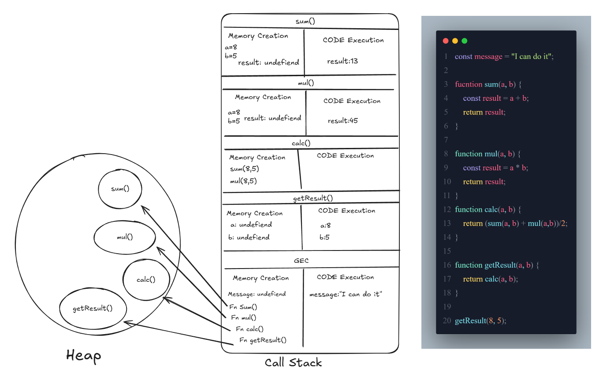

<h1>Full Diagram with Call Stack & Heap</h1>

```js
const message = "I can do it";

fucntion sum(a, b) {
    const result = a + b;
    return result;
}

function mul(a, b) {
    const result = a * b;
    return result;
}
function calc(a, b) {
    return (sum(a, b) + mul(a,b))/2;
}

function getResult(a, b) {
    return calc(a, b);
}

getResult(8, 5);
```

